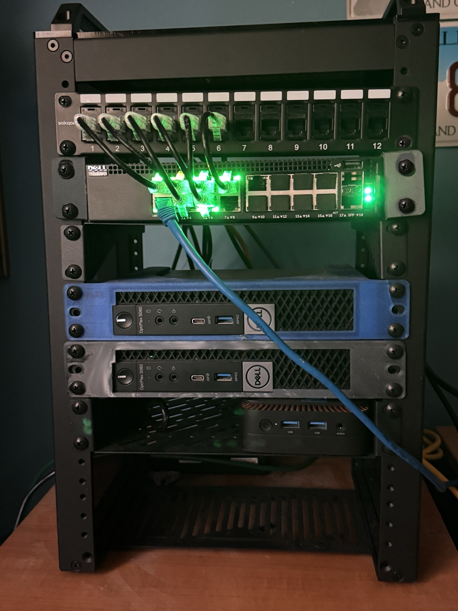
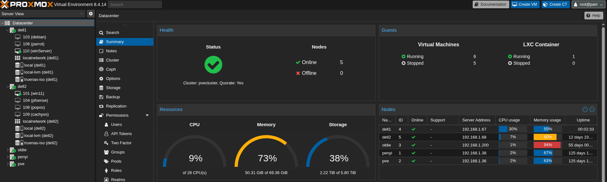

# 🏠 Cybersecurity Homelab

A personal cybersecurity homelab built to simulate real-world infrastructure using virtualization, containerization, and security tooling.

This environment focuses on **system administration, network control, monitoring, and security analysis** across a mixed Linux and Windows ecosystem.

---

# 📌 Overview

This homelab is built on a **Proxmox virtualization platform**, hosting multiple virtual machines and services used for cybersecurity experimentation and infrastructure management.

The lab is designed to provide hands-on experience with:

- Virtualization and infrastructure management
- Firewall configuration and network control
- Containerized applications (Docker)
- DNS filtering and traffic visibility
- Host-based monitoring and logging
- Cross-platform system administration

---

# 🎯 Lab Goals

- Build and manage a virtualized infrastructure using Proxmox  
- Configure and maintain firewall rules using pfSense  
- Deploy and manage services using Docker  
- Monitor system and network activity  
- Filter and control network traffic (DNS-level)  
- Practice security analysis and investigation  
- Strengthen troubleshooting and debugging skills  

---
## 🧰 Homelab Hardware

Compact homelab rack featuring:

- Rack-mounted patch panel and network switch
- Multiple Dell OptiPlex nodes running Proxmox
- Dedicated systems for virtualization, storage, and services
- Structured cabling for network organization

This hardware setup supports virtualization, containerized services, and network experimentation in a controlled environment.

# 🧰 Tools & Technologies

## 🖥️ Virtualization & Networking
- **Proxmox** — Type 1 hypervisor for managing virtual machines
- **pfSense** — firewall and router for network segmentation and control

## 💻 Systems
- **Ubuntu Server** — primary host for Docker services
- **Windows 11** — workstation environment
- **Windows Server** — server administration and services
- **Parrot OS** — security testing and analysis
- **TrueNAS** — storage and file management

## 🐳 Containerized Services (Docker)
- **Pi-hole** — network-wide DNS filtering
- **Wazuh** — host-based monitoring and security visibility
- **Wildid** — self-hosted application

## 🔐 Security & Analysis
- **Nmap** — network scanning and enumeration
- **Wireshark** — packet capture and analysis
- **SSH / Bash** — remote administration

## 🧪 Forensics
- **Autopsy** — forensic analysis
- **dd** — disk imaging
- **Hash verification tools** — integrity validation

---

# 🏗️ Lab Architecture

## Core Design

The lab follows a layered architecture:

1. **Proxmox (Host Layer)**
   - Runs all virtual machines
   - Central management of infrastructure

2. **pfSense (Network Layer)**
   - Acts as firewall and router
   - Controls traffic flow and access
   - Enables network segmentation

3. **Virtual Machines (System Layer)**
   - Ubuntu Server (Docker host)
   - Windows 11 / Windows Server
   - Parrot OS
   - TrueNAS

4. **Docker Services (Application Layer)**
   - Pi-hole (DNS filtering)
   - Wazuh (monitoring)
   - Wildid (self-hosted app)

---

# 🔍 Core Components

## 1. Proxmox Hypervisor
- Hosts all virtual machines
- Enables resource allocation and isolation
- Provides centralized infrastructure management
## 🖥️ Proxmox Datacenter Overview

---

## 2. pfSense Firewall
- Controls inbound/outbound traffic
- Manages routing between networks
- Supports secure lab segmentation
- Used for practicing firewall rule configuration

---

## 3. Ubuntu Server (Docker Host)
Acts as the main service host:
- Runs Docker containers
- Managed via SSH and CLI
- Central point for application deployment

---

## 4. Docker Environment

### Running Services:
- **Pi-hole**
  - DNS filtering and ad blocking
  - Visibility into network queries

- **Wazuh**
  - System monitoring and event visibility
  - Log collection and analysis

- **Wildid**
  - Self-hosted application
  - Used for container deployment practice

---

## 5. Windows Systems

### Windows 11
- Primary user system
- Used for management and testing

### Windows Server
- Used for:
  - server configuration
  - administrative tasks
  - system management

---

## 6. Parrot OS
Used for:
- security testing
- network scanning
- enumeration

---

## 7. TrueNAS
Provides:
- centralized storage
- file sharing
- backup capabilities

---

## 8. Network & Analysis Tools

- **Nmap** → discover hosts and services  
- **Wireshark** → analyze packet-level traffic  
- **SSH** → secure remote access  

---

# 🧠 Example Use Cases

- Filtering and analyzing DNS traffic with Pi-hole  
- Monitoring system activity with Wazuh  
- Managing virtual machines in Proxmox  
- Configuring firewall rules in pfSense  
- Scanning the network with Nmap  
- Capturing packets with Wireshark  
- Testing systems using Parrot OS  
- Managing storage with TrueNAS  
- Troubleshooting connectivity and system issues  

---

# 🛠️ Skills Demonstrated

- Virtualization (Proxmox)  
- Firewall configuration and network control (pfSense)  
- Linux server administration  
- Docker container management  
- DNS filtering and traffic control  
- Security monitoring and analysis  
- Network scanning and packet inspection  
- Windows system administration  
- Cross-platform troubleshooting  
- Storage management (TrueNAS)
